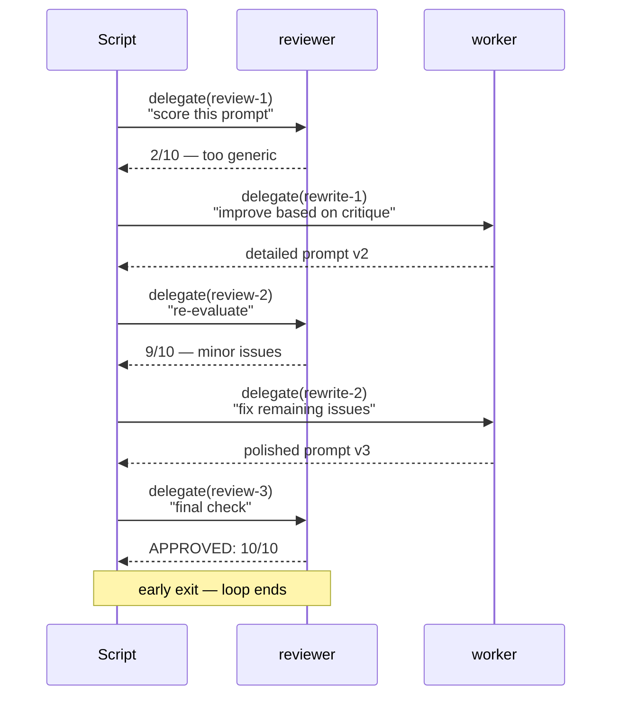

# pi-orchestrator

Code-guided durable execution for the [pi coding agent](https://pi.dev).

Has the agent ever promised it prompted a subagent "with a clear, detailed instruction" — but when you expanded the tool call, the actual prompt was vague, incomplete, or just wrong?

That's the problem this solves. Instead of the LLM describing subagent prompts in prose, **you write real TypeScript**. The orchestrator executes it literally — no paraphrasing, no hallucination, no lossy translation. You review the script before it runs.

## What it does

A single tool that lets the agent:

1. **Write** a TypeScript script using `delegate()` and `delegateParallel()`
2. **Show** you the script for review
3. **Execute** it — line by line, with live progress tracking

What you see in the script is exactly what runs. It supports **loops**, **conditionals**, and **stateful sessions** — things the built-in `subagent` tool can't do at all.

## Install

```bash
pi install npm:@nkyriazis/pi-orchestrator
```

## Example: Iterative prompt refinement

This script improves a system prompt through a feedback loop — reviewer critiques, worker rewrites, repeat until approved or exhausted:

```typescript
let prompt = "You are a helpful coding assistant.";
let critique = "Initial draft — not yet evaluated.";
let iterations = 0;
const maxIterations = 3;

while (iterations < maxIterations) {
  iterations++;
  consoleLog(`Iteration ${iterations}...`);

  // Separate sessions so each agent starts fresh — no history bias
  const review = await delegate(`review-${iterations}`, 'reviewer',
    `You are evaluating text only. Do NOT read or edit any files.\n\n` +
    `Evaluate this system prompt on a scale of 1-10.\n` +
    `Current prompt:\n${prompt}\n\n` +
    `Previous critique: ${critique}\n\n` +
    `Give specific improvement suggestions. Return only your evaluation text.\n` +
    `If 8 or above, start your response with "APPROVED: "`,
  );

  // Early exit if the reviewer is satisfied
  if (review.startsWith("APPROVED:")) {
    consoleLog(`Approved at iteration ${iterations}!`);
    break;
  }

  // Worker rewrites based on critique
  prompt = await delegate(`rewrite-${iterations}`, 'worker',
    `You are rewriting text only. Do NOT read or edit any files.\n\n` +
    `Improve this system prompt based on the critique below.\n` +
    `Return ONLY the new prompt text, nothing else.\n\n` +
    `Current prompt:\n${prompt}\n\n` +
    `Critique:\n${review}`,
  );

  critique = review;
}

finish(`Final system prompt after ${iterations} iterations:\n\n${prompt}`);
```

**What happens:**

| Call | Agent | Result |
|------|-------|--------|
| 1 | `reviewer` | Scores initial prompt, flags missing safety rules and scope boundaries |
| 2 | `worker` | Rewrites prompt addressing the critique |
| 3 | `reviewer` | Re-evaluates — catches that worker returned prose, not a clean prompt |
| 4 | `worker` | Produces a clean, properly structured version |

Each delegate call uses a **unique session** so the agent sees only the current task — no accumulated history. Use the same session key when you want the agent to remember prior turns.

The refinement loop in action:



## The DSL

Four globals injected into your script:

| Global | Purpose |
|--------|---------|
| `delegate(session, agent, task)` | Run a subagent. Same `session` key → accumulated history. Unique keys → fresh context each call. |
| `delegateParallel(tasks, options?)` | Run independent subagents concurrently. |
| `consoleLog(...args)` | Log output visible in results. |
| `finish(result)` | Declare the final output — surfaced prominently when execution ends. |

### Parallel fan-out

```typescript
const results = await delegateParallel([
  ['auth', 'scout', 'Find all authentication and authorization code. Map the flow end-to-end.'],
  ['errors', 'scout', 'Find all error handling patterns. Note where errors are swallowed or re-thrown.'],
  ['config', 'scout', 'Find all configuration — env vars, config files, hardcoded values.'],
], { maxConcurrency: 3 });

const [auth, errors, config] = results.map(([_, output]) => output);
finish(`Codebase analysis complete. Auth: ${auth}\nErrors: ${errors}\nConfig: ${config}`);
```

### Sequential pipeline

```typescript
const findings = await delegate('audit', 'scout', 'Find all exports in the codebase');
const review = await delegate('audit', 'reviewer', 'Critique the code quality: ' + findings);
const plan = await delegate('audit', 'planner', 'Create a prioritized fix list: ' + review);
finish(`Audit complete:\n${plan}`);
```

## Workflow

The orchestrator enforces a review step — the agent **cannot** create and execute in one turn:

| Step | Action | What happens |
|------|--------|-------------|
| 1 | `create` | Script is stored, not executed |
| 2 | `view` | You see the script and plan |
| 3 | `execute` | Script runs after you approve |
| 4 | `update` | Modify mid-flight if needed |

## Live tracking

While executing, a widget above the editor shows:

- Each delegate call's status (⏳ running, ✓ done, ✗ error)
- Current tool the subagent is executing
- Timing per call
- Console output tail

## Agents

Delegates to agents defined in `~/.pi/agent/agents/*.md`. Agent files use YAML frontmatter:

```markdown
---
name: scout
description: Fast codebase recon
tools: read, grep, find, ls, bash
---

You are a scout. Quickly investigate a codebase and return structured findings.
```

## API reference

| Action | Description |
|--------|-------------|
| `create` | Create a new orchestration. Requires `script` parameter. |
| `view` | View current script and execution state. Default action. |
| `execute` | Run the script. Resumes from last completed call if interrupted. |
| `update` | Replace the script in place. Resets execution state. |
| `abort` | Pause execution. |
| `restart` | Reset all calls and rerun from scratch. |

## Why "orchestrator" and not "subagent"?

The built-in `subagent` tool sends a natural language description to the LLM, which then constructs the prompt. The orchestrator sends **code** — the prompt is the code itself, executed verbatim. Less indirection, more trust. Loops and conditionals are real control flow, not descriptions of control flow.

## License

MIT
